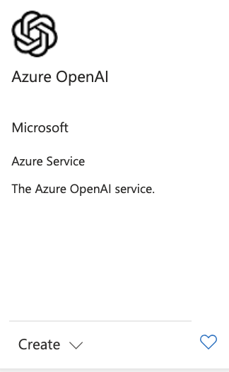
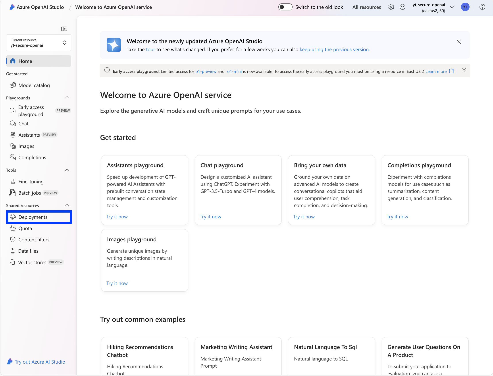
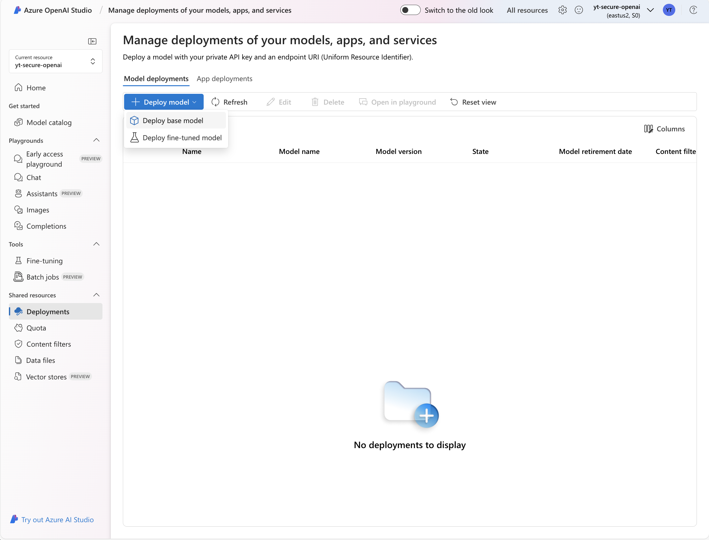
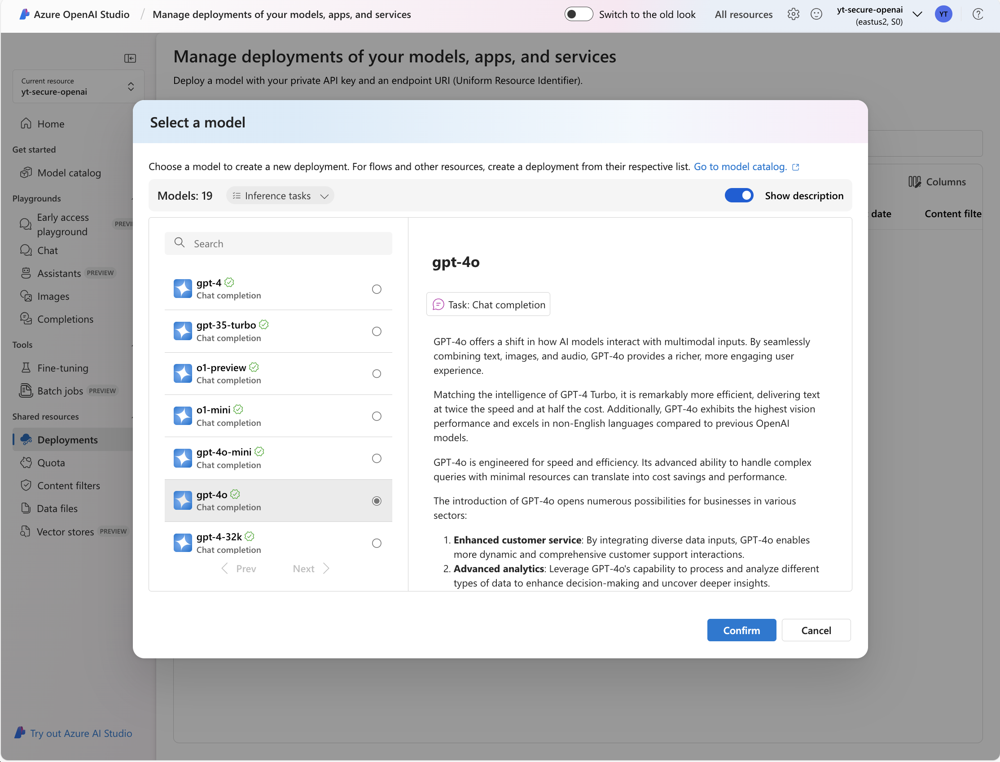
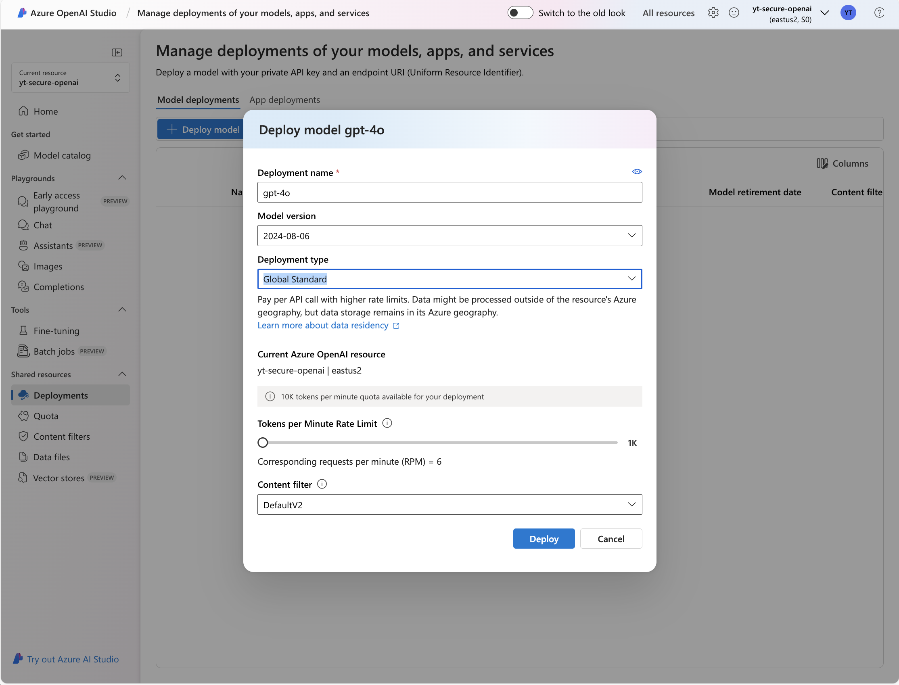

# User Managed ID を使用してセキュアに Azure Container Apps から Azure OpenAI へ接続

今日は、「User Managed ID を使用してセキュアに Azure Container Apps から Azure OpenAI へ接続」のエントリの中で、２つの内容を紹介したいと思います。

1. コンテナ化しなくても Azure Container Apps に Java アプリをデプロイできるようなった
2. Azrue Container Apps から Azure Open AI に対して、ユーザ・マネージド Identity を使用してセキュアに接続

## 1. コンテナ化しなくても Azure Container Apps にアプリをデプロイできるようになった

2024/9/11 に 「[Announcing the General Availability of Java experiences on Azure Container Apps](https://techcommunity.microsoft.com/t5/apps-on-azure-blog/announcing-the-general-availability-of-java-experiences-on-azure/ba-p/4238294)」が発表されました。


[Java on Azure Container Apps overview](https://learn.microsoft.com/azure/container-apps/java-overview) に記載されているように、Azure Container Apps に対して Java のサポートが強化されています。

例えば、マネージドのサービスとして、Azure Container Apps で下記の Spring Components をサポートしています

* Eureka Server for Spring
* Config Server for Spring
* Admin for Spring

また、[Quickstart: Launch your first Java application in Azure Container Apps](https://learn.microsoft.com/azure/container-apps/java-get-started?pivots=war) に記載されていますが、Azure Container Apps では新たに `Cloud Build Service` という機能を提供しています。これによって、Java の成果物である jar や war ファイルから、直接 Azure Container Apps にアプリをデプロイできるようになりました。指定した Java の成果物から自動的にコンテナのイメージを作成してデプロイするため、自分自身で Dockerfile のコンテナ定義の記述が不要なだけでなく、コンテナのビルドやプッシュ等の操作も不要になります。

これを Azure Container Apps で実現するために、`az containerapp up` というコマンドを実行し、引数に Java の成果物を指定します。詳しくは下記の手順の中で詳しく紹介します。  
（ご参照： `2.8 Azure Container Apps インスタンスの作成`）

これにより、今までよりも非常に簡単に Java のアプリケーションを Azure Container Apps に対してデプロイできるようになっています。Azure Container Apps はインスタンス数を０から、必要に応じてスケールさせる事もできるようになっており、非常に便利なサービスですのでぜひお試しください。

## 2. Azrue Container Apps から Azure Open AI に対して、ユーザ・マネージド Identity を使用してセキュアに接続

昨今、セキュリティ対策は非常に重要で、企業にとってより安全なシステムを構築する事は必須となっています。マイクロソフトは、本番環境などのよりセキュアな環境を構築する必要がある場合には、パスワードを利用したアクセスの代わりに Microsoft Entra ID の認証方法を利用して接続する、Managed Identity を使用した接続方法を推奨しています。

これを利用することで、特定のリソースに対して、そのスコープの範囲内だけ有効な権限を与え、セキュリティの範囲を柔軟に指定することができるようになります。

Managed Identity の詳細は、別途こちらの記事「[What are managed identities for Azure resources?](https://learn.microsoft.com/entra/identity/managed-identities-azure-resources/overview)」に任せますが、今回のエントリでは、ユーザ・マネージド Identity の設定方法を、詳細にステップ・バイ・ステップでわかりやすく紹介します。

この手順に従う事でどのようにして設定するのかが理解できるだけでなく、他のリソースで設定を行う上でも参考になるかと思います。

### ユーザ・マネージド ID の設定方法の手順

Azure Container Apps でユーザ・マネージド ID を利用して Azure OpenAI に接続するために下記の手順で環境を構築します。

1. 環境変数の設定
2. リソース・グループの作成
3. Azure OpenAI のインスタンスを作成 (Azure Portalから)
4. User Managed Identity の作成
5.   ユーザ・マネージド ID から Azure OpenAI に対するロール設定
6. Azure Container Apps Environment の作成
7. Spring Boot Web アプリケーションの作成
8. Azure Container Apps インスタンスの作成
9. Azure Container Apps にユーザ・マネージドID をアサイン
10. 動作確認

### 2.1. 環境変数の設定

環境を構築する際に、環境変数を設定しておきます。これにより繰り返し入力する手間を省きます。

```bash
export RESOURCE_GROUP=yoshio-OpenAI-rg
export LOCATION=eastus2
export AZURE_OPENAI_NAME=yt-secure-openai
export OPENAI_DEPLOY_MODEL_NAME=gpt-4o
export USER_MANAGED_IDENTITY_NAME=yoshio-user-managed-id
export SUBSCRIPTION=$(az account show --query id --output tsv)
```

環境変数名と説明を下記に記載します。環境に応じて名前を変更したい場合、下記に記載する内容を参考に、各リソース名を変更して下さい。

| 環境変数名      | 説明      |
| ------------- | ------------- |
| RESOURCE_GROUP | 環境構築するリソース・グループ名 |
| LOCATION | 環境を構築するロケーション |
| USER\_MANAGED\_IDENTITY\_NAME | ユーザ・マネージド ID の名前 |
| AZURE\_OPENAI\_NAME |Azure OpenAI の名前 |
| OPENAI\_DEPLOY\_MODEL\_NAME | デプロイする AI モデル名 |
| SUBSCRIPTION | 利用するサブスクリプション ID |


### 2.2. リソース・グループの作成

まず、はじめに Azure の環境でリソース・グループを作成します。`--location` で指定した Azure リージョンに作成します。

```azurecli
az group create --name $RESOURCE_GROUP --location $LOCATION
```

### 2.3. Azure OpenAI のインスタンスを作成 (Azure Portalから)

次に、Azure OpenAI のインスタンスを作成します。このインスタンスは `必ず` Azure Portal 上で作成をして下さい。

Azure Portal から `Azure OpenAI` を検索して探します。すると下記が表示されます。



`Create` をクリックすると、下記の画面が表示されます。`Create` ボタンを押して下さい。


`Create` ボタンを押すと下記の画面が表示されます。ここで、`リソース・グループ`、`リージョン`、`名前`、`Price Tier` など、それぞれを適切な値で設定します。


今回は Managed Identity の設定を優先で行いますので、ネットワークはデフォルトのままで設定を行います。
よりセキュアなネットワーク環境を構築したい場合は別途設定を行うことができます。


最後に設定内容を確認し、インスタンスを作成します。


インスタンスの作成が完了すると下記の画面が表示されます。ここで `Go to Azure OpenAI Studio` のボタンを押して下さい。


Azure OpenAI Studio の画面に移動すると下記の画面が表示されます。ここで `Deployments` を押します。



`Deployments` を押すと下記の画面が表示されます。ここで `+ Deploy Model` ボタンから `Deploy base model` を選択します。



すると下記の画面が表示され、AI のモデルを選択する画面が表示されます。ここでは `gpt-4o` を選択します。



モデルを選択するとデプロイするために必要な情報の入力が求められますので環境に応じて必要な設定を行い、最後に `Deploy` ボタンを押します。



正しく、モデルがデプロイされたら下記のような画面が表示されます。


以上で、Azure Portal から Azure OpenAI のインスタンスの完了です。Azure OpenAI のインスタンスが作成できた後、環境構築や Java プログラムの実装で必要な情報を環境変数に代入しておきます。

```bash
export OPEN_AI_RESOURCE_ID=$(az cognitiveservices account list \
                                -g $RESOURCE_GROUP \
                                --query "[0].id" \
                                --output tsv)
export OPEN_AI_ENDPOINT=$(az cognitiveservices account show \
                                --resource-group $RESOURCE_GROUP \
                                --name $AZURE_OPENAI_NAME \
                                --query "properties.endpoint" \
                                --output tsv)
export OPEN_AI_ACCESS_KEY=$(az cognitiveservices account keys list \
                                --resource-group $RESOURCE_GROUP \
                                --name $AZURE_OPENAI_NAME \
                                --query key1 --output tsv)
```

ここでは、実際に下記の環境変数を設定しています。

| 環境変数名      | 説明      |
| ------------- | ------------- |
| OPEN\_AI\_RESOURCE\_ID | OpenAI のリソースID<br> (ロール設定の適用範囲のスコープで必要) |
| OPEN\_AI\_ENDPOINT | OpenAI のエンドポイント<br> (Java アプリで接続する際に必要) |
| OPEN\_AI\_ACCESS\_KEY | OpenAI のアクセスキー<br> (ローカル環境での Java アプリ開発時に必要) |


> 注意：  
> Azure OpenAI は下記のように Azure CLI を利用して環境を構築する事ができます。  
> しかし、2024 年 9 月時点で、下記の Azure CLI を利用して Azure OpenAI の環境を作成した場合、その環境に対して Managed Identity を利用した Java アプリが動作しませんでした。そこで、今回は Azure CLI を利用せず Azure Portal を利用した Azure OpenAI のインスタンス作成をお勧めします。

```azurecli
az cognitiveservices account create \
  --name $AZURE_OPENAI_NAME \
  --resource-group $RESOURCE_GROUP \
  --kind OpenAI \
  --sku S0 \
  --location $LOCATION
az cognitiveservices account deployment create \
  --name $AZURE_OPENAI_NAME \
  --resource-group  $RESOURCE_GROUP \
  --deployment-name $OPENAI_DEPLOY_MODEL_NAME \
  --model-name $OPENAI_DEPLOY_MODEL_NAME \
  --model-version "2024-08-06"  \
  --model-format OpenAI \
  --sku-capacity "20" \
  --sku-name "GlobalStandard"
```

### 2.4. User Managed Identity の作成

Azure OpenAI のインスタンスができたので、次にユーザ・マネージド ID を作成します。
`az identity create` コマンドで作成します。

```azurecli
az identity create -g $RESOURCE_GROUP -n $USER_MANAGED_IDENTITY_NAME
```

ユーザ・マネージド ID の作成が完了したら、後で実行するコマンドや Java プログラムの実行に必要な情報を取得し環境変数に代入しておきます。

```bash
export USER_MANAGED_ID_CLIENT_ID=$(az identity list \
                                        -g $RESOURCE_GROUP \
                                        --query "[0].clientId" \
                                        -o tsv)
export USER_MANAGED_ID_PRINCIPAL_ID=$(az identity list \
                                        -g $RESOURCE_GROUP \
                                        --query "[0].principalId" \
                                        -o tsv)
export USER_MANAGED_ID_RESOURCE_ID=$(az identity list \
                                        -g $RESOURCE_GROUP \
                                        --query "[0].id" \
                                        -o tsv)
```

それぞれの環境変数の値の意味と、それを今後どこで使用するのかを下記に説明しています。

| 環境変数名      | 説明      |
| ------------- | ------------- |
| USER\_MANAGED\_ID\_CLIENT\_ID | User Managed ID の Client ID<br> (Java アプリの実装で必要) |
| USER\_MANAGED\_ID\_PRINCIPAL\_ID | User Managed ID の プリンシパル ID<br> (ロールのアサインで必要) |
| USER\_MANAGED\_ID\_RESOURCE\_ID | User Managed ID のリソース ID<br> (Container Apps の ID のアサインで必要) |

### 2.5. ユーザ・マネージド ID から Azure OpenAI に対するロール設定

`az role assignment create` コマンドを実行し、ユーザ・マネージド ID から OpenAI のリソースに対して `Cognitive Services OpenAI User` の権限で処理を行えるようにロールを割り当てます。

`$OPEN_AI_RESOURCE_ID` は OpenAI のリソース ID を示し、ここではそのリソースに限定してロールを割り当てています。さらに、過剰な権限を与えるのではなく、アプリケーションの動作に必要な権限のみを与え、より安全なセキュリティ対策を施しています。

```azurecli
az role assignment create --assignee $USER_MANAGED_ID_PRINCIPAL_ID \
                          --scope $OPEN_AI_RESOURCE_ID \
                          --role "Cognitive Services OpenAI User" 
```

指定できるロールは他に、下記のようなロールを割り当てる事ができます。

* Cognitive Services OpenAI User
* Cognitive Services OpenAI Contributor
* Cognitive Services Contributor
* Cognitive Services Usages Reader

それぞれのロールでどのような処理ができるかは、「[Role-based access control for Azure OpenAI Service](https://learn.microsoft.com/azure/ai-services/openai/how-to/role-based-access-control)」に詳しい内容が記載されていますので、どうぞご覧ください。

### 2.6. Azure Container Apps Environment の作成

次に Azure Container Apps Environment を作成します。Azure CLI で作成するためには、Azure CLI に対して、追加の Extension やプロバイダの登録が必要です。下記を一度も実行していない場合は、下記のコマンドを実行して下さい。

```azurecli
az upgrade
az extension add --name containerapp --upgrade -y
az provider register --namespace Microsoft.Web
az provider register --namespace Microsoft.App
az provider register --namespace Microsoft.OperationalInsights
```

次に、Azure Container Apps Environment の名前を環境変数で定義します。こちらは皆様の環境に適切な任意の名前を設定してください。

```bash
export CONTAINER_ENVIRONMENT=YTContainerEnv3
```

最後に、`az containerapp env create` のコマンドを実行して環境を構築して下さい。

```azurecli
az containerapp env create --name $CONTAINER_ENVIRONMENT \
                           --enable-workload-profiles \
                           -g $RESOURCE_GROUP \
                           --location $LOCATION
```

### 2.7. Spring Boot Web アプリケーションの作成

ここまでで、Azure OpenAI、Azure Container Apps Environment の構築が終わりました。
そこで、ここからは Java のプロジェクトを作り、Java アプリから OpenAI のモデルを呼び出す簡単なアプリを実装したいと思います。今回は、Spring Boot のアプリとして実装します。

#### 2.7.1 Spring Boot プロジェクトの作成

下記のコマンドを実行し、Spring Boot のプロジェクトを作成して下さい。プロジェクトを作成しダウンロードしたのち unzip でアーカイブを展開して下さい。

```bash
curl https://start.spring.io/starter.zip \
  -d dependencies=web \
  -d type=maven-project \
  -d language=java \
  -d bootVersion=3.3.3 \
  -d baseDir=Yoshio-AI-App-Spring-Boot \
  -d groupId=com.yoshio3 \
  -d artifactId=Yoshio-AI-App \
  -d name=myproject \
  -d packageName=com.yoshio3 \
  -o YoshioAIProject.zip

unzip YoshioAIProject.zip
```

上記のコマンドで下記のディレクトリ構造を持つプロジェクトが生成されます。

```text
├── HELP.md
├── mvnw
├── mvnw.cmd
├── pom.xml
└── src
    ├── main
    │   ├── java
    │   │   └── com
    │   │       └── yoshio3
    │   │           └── MyprojectApplication.java
    │   └── resources
    │       ├── application.properties
    │       ├── static
    │       └── templates
    └── test
        └── java
            └── com
                └── yoshio3
                    └── MyprojectApplicationTests.java
```

#### 2.7.2 pom.xml プロジェクト・ファイルの編集

ルートディレクトリに存在する `pom.xml` ファイルに対して、下記の依存ライブラリを追加します。これで、OpenAI の接続や認証に必要なライブラリが含まれるようになります。

```xml
	<dependencies>
       ......
		<dependency>
			<groupId>com.azure</groupId>
			<artifactId>azure-ai-openai</artifactId>
			<version>1.0.0-beta.11</version>
		</dependency>
       <dependency>
			<groupId>com.azure</groupId>
			<artifactId>azure-identity</artifactId>
			<version>1.13.2</version>
		</dependency>
		<dependency>
			<groupId>org.slf4j</groupId>
			<artifactId>slf4j-api</artifactId>
			<version>2.0.16</version>
		</dependency>
        <dependency>
            <groupId>ch.qos.logback</groupId>
            <artifactId>logback-core</artifactId>
            <version>1.5.8</version>
        </dependency>
        <dependency>
            <groupId>ch.qos.logback</groupId>
            <artifactId>logback-classic</artifactId>
            <version>1.5.8</version>
        </dependency>
	</dependencies>
```

#### 2.7.3 RESTful エンドポイントの実装 (メインの実装部分)

次に、`src/main/java/com/yoshio3` ディレクトリ配下に `AIChatController.java` ファイルを作成します。そして下記の実装を行います。ここでは RESTful エンドポイントを一つ定義し、リクエストを受信した後 OpenAI に対して問い合わせを行うプログラムを実装しています。

```java
package com.yoshio3;

import org.springframework.web.bind.annotation.RestController;
import com.azure.ai.openai.OpenAIClient;
import com.azure.ai.openai.OpenAIClientBuilder;
import com.azure.ai.openai.models.ChatCompletions;
import com.azure.ai.openai.models.ChatCompletionsOptions;
import com.azure.ai.openai.models.ChatRequestAssistantMessage;
import com.azure.ai.openai.models.ChatRequestMessage;
import com.azure.ai.openai.models.ChatRequestSystemMessage;
import com.azure.ai.openai.models.ChatRequestUserMessage;
import com.azure.core.credential.AzureKeyCredential;
import com.azure.identity.ManagedIdentityCredential;
import com.azure.identity.ManagedIdentityCredentialBuilder;
import com.fasterxml.jackson.core.JsonProcessingException;
import com.fasterxml.jackson.databind.ObjectMapper;
import java.util.ArrayList;
import java.util.List;
import org.slf4j.Logger;
import org.slf4j.LoggerFactory;
import org.springframework.beans.factory.annotation.Value;
import org.springframework.web.bind.annotation.PostMapping;
import org.springframework.web.bind.annotation.RequestBody;


@RestController
public class AIChatController {

    private static final Logger LOGGER = LoggerFactory.getLogger(AIChatController.class);

    @Value("${USER_MANAGED_ID_CLIENT_ID}")
    private String userManagedIDClientId;

    @Value("${OPENAI_ENDPOINT}")
    private String openAIEndpoint;

    @Value("${OPENAI_KEY}")
    private String openAIKey;

    private static final String OPEN_AI_CHAT_MODEL = "gpt-4o";

    /**
     * This API is used to chat with OpenAI's GPT-4 model. And if user ask somethings, it will
     * return the message with Pirate language.
     * 
     * Ex. You can invoke the API by using the following command: curl -X POST
     * http://localhost:8080/askAI -H "Content-Type: application/json" -d '{"message":"Please tell
     * me about the appeal of Spring Boot in Japanese."}'
     * 
     * @param message RequestMessage
     * @return String Response from OpenAI
     */

    @PostMapping("/askAI")
    public String chat(@RequestBody RequestMessage message) {
        return getResponseFromOpenAI(message.getMessage());
    }

    /**
     * This method is used to get the response from OpenAI.
     * 
     * For production environment, you can use Managed Identity to authenticate with OpenAI. If you
     * want to use Managed Identity, please use the ManagedIdentityCredentialBuilder.
     * 
     * For local development, you can use AzureKeyCredential to authenticate with OpenAI.
     * 
     * @param message RequestMessage
     * @return String Response from OpenAI
     */

    private String getResponseFromOpenAI(String message) {
        try {
            // Create OpenAI client with User Managed Identity
            ManagedIdentityCredential credential =
                    new ManagedIdentityCredentialBuilder().clientId(userManagedIDClientId).build();
            OpenAIClient openAIClient = new OpenAIClientBuilder().credential(credential)
                    .endpoint(openAIEndpoint).buildClient();

            // Create OpenAI client without Managed Identity (For local development)
            // OpenAIClient openAIClient = new OpenAIClientBuilder().endpoint(openAIEndpoint)
            // .credential(new AzureKeyCredential(openAIKey)).buildClient();

            // Create Chat Request Messages
            List<ChatRequestMessage> chatMessages = new ArrayList<>();
            chatMessages.add(new ChatRequestSystemMessage("You are a helpful assistant. You will talk like a pirate."));
            chatMessages.add(new ChatRequestUserMessage("Can you help me?"));
            chatMessages.add(new ChatRequestAssistantMessage("Of course, me hearty! What can I do for ye?"));
            chatMessages.add(new ChatRequestUserMessage(message));
            ChatCompletionsOptions chatCompletionsOptions = new ChatCompletionsOptions(chatMessages);

            // Invoke OpenAI Chat API
            ChatCompletions chatCompletions = openAIClient.getChatCompletions(OPEN_AI_CHAT_MODEL, chatCompletionsOptions);
            StringBuilder response = new StringBuilder();
            chatCompletions.getChoices()
                    .forEach(choice -> response.append(choice.getMessage().getContent()));

            return response.toString();
        } catch (Exception e) {
            StackTraceElement[] stackTrace = e.getStackTrace();
            LOGGER.error(e.getMessage());
            LOGGER.error(e.getLocalizedMessage());
            Throwable cause = e.getCause();
            if (cause != null) {
                LOGGER.error(e.getCause().toString());
            }
            for (StackTraceElement element : stackTrace) {
                LOGGER.error(element.toString());
            }
            return e.getMessage();
        }
    }
}
```

ここで注意していただきたいのは、`OpenAIClient` のインスタンスを２種類の方法で記述している点です。現在有効になっているコードは `ManagedIdentityCredential` を利用して User Managed Identity で Azure OpenAI に接続する実装が有効になっています。このコードは Azure 環境上にある時だけ動作します。仮にローカルの環境、もしくは Azure ではない環境で実行した場合は、このコードは動作しません。

一方で、開発時にはローカルで開発を行い動作検証を行う必要があります。このような時には User Managed Identity は使用できません。そこで、OpenAI のアクセス KEY を利用して接続を行います。そのためには、現在コメントしている `AzureKeyCredential(openAIKey))` を利用した OpenAIClient のインスタンスの生成をコメントアウトし、利用してください。

また、上記の実装でロガーとして `slf4j` と `logback` を利用して実装しています。設定は `/src/main/resources` ディレクトリ配下に `logback-spring.xml` ファイルを作成し記載しています。Log に関する詳細な設定や説明は割愛しますが、GitHub にはオリジナルのコードも公開していますので必要な場合は、そちらをご参照ください。

最後に、簡単にこのコードの中身を紹介します。ユーザから何らかのご質問、もしくは会話のメッセージを受信すると、`SYSTEM` で定義した `pirate` 内容に従って、海賊の口調で返信されます。海賊らしい口調で回答が返ってきますので、お楽しみ下さい。

#### 2.7.4 エンドポイントで受信する JSON フォーマットの定義

続いて、この RESTful サービスに送信する JSON のデータフォーマットの定義を行います。今回は HTTP リクエストの BODY で `{"message":"What is the benefit of Spring Boot"}` のようなメッセージを処理できるようにするため、下記のクラスを定義しています。

```java
package com.yoshio3;

public class RequestMessage {
    private String message;

    public void setMessage(String message) {
        this.message = message;
    }

    public String getMessage() {
        return message;
    }
}
```

以上で、必要最低限の動作用確認用のコードが出来上がりました。

#### 2.7.5 アプリケーションの設定

次に Azure OpenAI に接続をするための設定を行います。

2.1 〜 2.6 までのシステム環境構築の際に必要な情報を全て環境変数の中に入れてきました。そこで Java プログラムの中で必要な情報を取得するために下記のコマンドを実行して下さい。

```bash
echo "USER_MANAGED_ID_CLIENT_ID" : $USER_MANAGED_ID_CLIENT_ID
echo "OPEN_AI_ENDPOINT" : $OPEN_AI_ENDPOINT
echo "OPEN_AI_ACCESS_KEY" : $OPEN_AI_ACCESS_KEY
```

上記の実行結果を `/src/main/resources/` ディレクトリ配下に存在する `application.properties` ファイルに記述して下さい。

```text
spring.application.name=AI-Chatbot
logging.level.root=INFO
logging.level.org.springframework.web=INFO

USER_MANAGED_ID_CLIENT_ID=********-****-****-****-************
OPENAI_ENDPOINT=https://********.openai.azure.com/
OPENAI_KEY=********************************
```

> 注意:  
>  `OPENAI_KEY` は OpenAI のアクセス・キーです。これは開発環境で開発の際にのみ使用し本番環境では使わないようにして下さい。

####　2.7.6 (オプション)：ローカル環境で動作確認

ローカル環境で、Java のプログラムが動作するか確認したい場合、上記の `AIChatController` クラスのコードで `OpenAIClient` インスタンスの生成部分のコメントを入れ替えて実行して下さい。

```java
// ManagedIdentityCredential credential = new ManagedIdentityCredentialBuilder().clientId(userManagedIDClientId).build();
// OpenAIClient openAIClient = new OpenAIClientBuilder().credential(credential)
//                    .endpoint(openAIEndpoint).buildClient();

 OpenAIClient openAIClient = new OpenAIClientBuilder().endpoint(openAIEndpoint)
                   .credential(new AzureKeyCredential(openAIKey)).buildClient();
```

修正後、下記のコマンドを実行して下さい。

```bash
mvn spring-boot:run
```

Spring Boot のアプリケーションが正常に起動した場合、8080 番ポートでサービスを待ち受けています。そこで下記の curl コマンドを実行して、Azure OpenAI に対して問い合わせができているかを確認して下さい。

```bash
curl -X POST http://localhost:8080/askAI \
     -H "Content-Type: application/json" \
     -d '{"message":"What is the benefit of the Spring Boot?"}'
```

コマンドを実行する度に回答は変わりますが、例えば下記のように海賊口調で回答が返ってきます。

```text
あい、船長！Spring Bootの利益について説明するぜ。

Spring Bootは、迅速なアプリケーション開発を助けるフレームワークじゃ。
設定が少なく、スタンドアロンなアプリケーションを簡単に作成できる。

さらに、自動設定があるため、多くの設定を手動で行う必要がない。
依存関係管理も簡単で、ほとんどのプロジェクトで使用されるライブラリが組み込まれておる。

起動が早く、デプロイメントも容易で、クラウド上での運用にも適しとる。
開発者が生産性を上げるための強力なツールだ。

これで手伝えることはあるかい
```

ローカルでの検証が終わった後、`ManagedIdentityCredential` で `OpenAIClient` のインスタンスを生成するように元に戻して下さい。

#### 2.7.7 アプリケーションのビルドと成果物の作成

上記が完了した後、アプリケーションをビルドして成果物を作成して下さい。

```bash
mvn clen package
```

プロジェクトをビルドすると下記のように `target` ディレクトリ配下に成果物が出来ます。

ここでは Spring Boot のアプリケーションは `Yoshio-AI-App-0.0.1-SNAPSHOT.jar` として出来ています。

```bash
> ls -l target 
total 40876
-rw-r--r-- 1 teradayoshio wheel 41847613  9 14 14:52 Yoshio-AI-App-0.0.1-SNAPSHOT.jar
-rw-r--r-- 1 teradayoshio wheel     7003  9 14 14:52 Yoshio-AI-App-0.0.1-SNAPSHOT.jar.original
drwxr-xr-x 5 teradayoshio wheel      160  9 14 20:34 classes
drwxr-xr-x 3 teradayoshio wheel       96  9 14 14:52 generated-sources
drwxr-xr-x 3 teradayoshio wheel       96  9 14 14:52 generated-test-sources
drwxr-xr-x 3 teradayoshio wheel       96  9 14 14:52 maven-archiver
drwxr-xr-x 3 teradayoshio wheel       96  9 14 14:52 maven-status
drwxr-xr-x 4 teradayoshio wheel      128  9 14 14:52 surefire-reports
drwxr-xr-x 3 teradayoshio wheel       96  9 14 20:34 test-classes
```

### 2.8. Azure Container Apps インスタンスの作成

Java プログラムの実装も終わりましたので、最後にこの Java アプリケーションを Azure Container Apps にデプロイして動かしたいと思います。

コンテナのアプリケーションに対してつける名前を環境変数 `CONTAINER_APP_NAME` で指定します。そして、Spring Boot の成果物のパスとファイル名を `JAR_FILE_PATH_AND_NAME` で定義します。

```bash
export CONTAINER_APP_NAME=yoshio-ai-app
export JAR_FILE_PATH_AND_NAME=./target/Yoshio-AI-App-0.0.1-SNAPSHOT.jar
```

「`1.コンテナ化しなくても Azure Container Apps にアプリをデプロイできるようになった` 」で説明しましたが、Azure Container Apps に対してデプロイする際に、コンテナのイメージを自分で作ってデプロイする必要はなくなりました。今は、`Yoshio-AI-App-0.0.1-SNAPSHOT.jar` という成果物があるだけですが、これを元に Azure Container Apps に対してデプロイをします。

そのためには、`az containerapp up` コマンドを実行します。引数を確認していただければ分かるとおり `--artifact $JAR_FILE_PATH_AND_NAME` を指定しているだけで、コンテナのイメージは引数で一切指定していません。このコマンドを実行すると自動的にビルドの環境を構築してコンテナをビルドしてデプロイしてくれるようになります。

下記のコマンドを実行して下さい。

```azurecli
az containerapp up \
  --name $CONTAINER_APP_NAME \
  --resource-group $RESOURCE_GROUP \
  --subscription $SUBSCRIPTION \
  --location $LOCATION \
  --environment $CONTAINER_ENVIRONMENT \
  --artifact $JAR_FILE_PATH_AND_NAME \
  --ingress external \
  --target-port 8080 \
  --env-vars AZURE_LOG_LEVEL=2 \
  --query properties.configuration.ingress.fqdn
```

> 注意:   
> コンテナを作成する際に若干カスタマイズも可能です。必要に応じて下記で用意されている環境変数をご利用ください。
>  「[Build environment variables for Java in Azure Container Apps](https://learn.microsoft.com/en-us/azure/container-apps/java-build-environment-variables)」

### 2.9. Azure Container Apps にユーザ・マネージドID をアサイン

Azure Container Apps にアプリをデプロイしたので、最後にこの作成したコンテナに、User Managed Identity を適用して利用できるようにしたいと思います。`az containerapp identity assign` コマンドを実行して下さい。

```azurecli
az containerapp identity assign --name $CONTAINER_APP_NAME \
                                --resource-group $RESOURCE_GROUP \
                                --user-assigned $USER_MANAGED_ID_RESOURCE_ID
```

以上で、User Managed Identity の設定が完了しました。

### 2.10. 動作確認

上記で、すべての設定が完了したので、動作確認を行いたいと思います。
まずは、コンテナの Ingress に付加された FQDN のホスト名を取得します。

```bash
export REST_ENDPOINT=$(az containerapp show -n $CONTAINER_APP_NAME \
          -g $RESOURCE_GROUP \
          --query properties.configuration.ingress.fqdn --output tsv)
```

続いて、取得したホスト名に対して、RESTful エンドポイントの URL を付加して接続をします。

```bash
curl -X POST https://$REST_ENDPOINT/askAI \
     -H "Content-Type: application/json" \
     -d '{"message":"What is Spring Boot? please explain around 500 words?"}'
```

実行する度に回答は異なりますが、下記のような回答が得られます。

```text
おお、喜んで答えるぜ！Spring Bootは、Javaのためのフレームワークであり、
迅速にスタンドアロンのプロダクショングレードのアプリケーションを開発する手助けをするんじゃ。

Spring Frameworkの拡張版で、設定を最小限に抑え、すぐに使える状態を提供するのが特徴じゃ。
これにより、開発者は複雑な設定を気にせず、ビジネスロジックの開発に集中できるんじゃよ。

Spring Bootの一つの魅力は自動設定機能だ。これにより、依存関係や設定を自動的に推測してくれるんじゃ。
そのため、必要最低限の設定でアプリが動き出すのじゃ。

さらに、組み込みのサーバー（TomcatやJettyなど）をサポートしており、専用のサーバーを準備なしに、
アプリを単独で実行可能なんじゃ。

初心者でも扱いやすく、プロジェクトの迅速な立ち上げに非常に役立つツールじゃ。Spring Bootは、
多くの企業や開発者に支持される、強力で柔軟なソリューションなんじゃよ！
海賊のように、自由自在にアプリを航海させてみるといいぜ！
```

### 3 まとめ

今回は、非常に詳細にステップ・バイ・ステップでユーザ・マネージド ID を利用してセキュアに Azure Container Apps から Azure OpenAI に接続する方法をご紹介しました。

ユーザ・マネージド ID は一番最初に環境構築する際には手間がかかるように見えるかもしれませんが、この ID は再利用ができる点が大きな利点です。
構築するシステムの数が少なかったり柔軟性がさほど求められない場合はシステム・マネージドのID を採用する方が良いですが、数が多くなる場合はユーザ・マネージド ID がとても便利です。

一度作成したユーザ・マネージドの ID に対して適用したロールで、仮に別の環境から、例えば Azure App Service や Azure Functions 、Azure Kubernetes Services のような環境上でサービスを提供する際にも、同じ ID を再利用できるようになるため、利用するシステムやサービスの数が多くなればなるほど便利になります。

マネージド ID を利用して、どうぞセキュアな環境の構築をお試しください。
